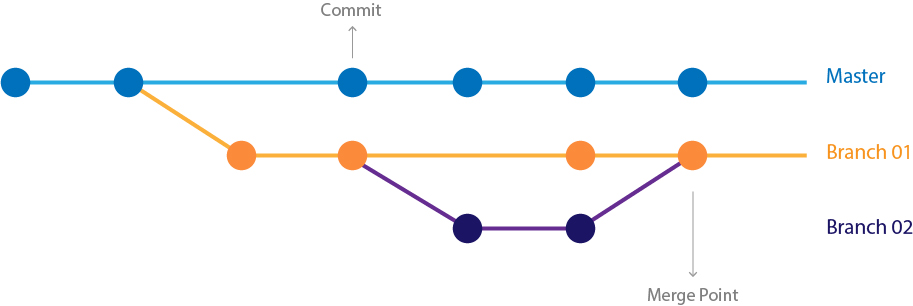

## Hello git
### Git basics
(This document optimized for [reveal-md](https://github.com/webpro/reveal-md))

---

### Agenda
1. Intro
1. In the old days...
1. Why using VCS?
1. Why git?
1. Git fundamentals
1. Practice time


---

### Intro
Hello, I'm Yuval

<div style="float: left">
    
</div>
Practice: add 2 more files and commit
---

### Intro
Tools for today

* Browser (Chrome)

* Terminal (bash preferable, cmd possible)

* Git (run `git version`)

* Vscode (run `code .`)

---

### In the old days...

How do you keep versions without a version control system?

---

### Why using VCS?

* Code backup
<!-- .element: class="fragment" -->

* Keep code history
<!-- .element: class="fragment" -->

* Book keeping of changes (who did what)
<!-- .element: class="fragment" -->

* Sync code between developers
<!-- .element: class="fragment" -->

---

### Why Git?
* Today git is the standard VCS, and the most used one
<!-- .element: class="fragment" -->

* Fast(er)
<!-- .element: class="fragment" -->

* Design for distributed development (most operation are local)
<!-- .element: class="fragment" -->

* Good for any size of project
<!-- .element: class="fragment" -->

---

### Git [fundamentals](https://www.youtube.com/watch?v=_ALeswWzpBo)

#### What is Git?

* An application which manage changes in a similar way to a file system.

* A command line interface (CLI) tool

* Has different clients built on top of it's API

* Not the same as (or created by) github (!)


---

### Git [fundamentals](https://www.youtube.com/watch?v=_ALeswWzpBo)

<div style="float: left">
    
</div>

* Commit - project snapshot at a specific time
* Branch - a pointer to a commit (Dynamic)
* Tag - pointer to a specific (Static)
* Default branch - main (master)

---

### Git [fundamentals](https://www.youtube.com/watch?v=_ALeswWzpBo)

<div style="float: left">
    
</div>

* HEAD - pointer the current commit/branch you are viewing
* detached HEAD - A state [when HEAD](https://www.cloudbees.com/blog/git-detached-head) is pointing to commit directly
* Merge - joining two or more commit histories


---

### Git [fundamentals](https://www.youtube.com/watch?v=_ALeswWzpBo)

Files in Git has three main states: modified, staged, and committed:

<div style="float: left">
    
</div>

* Staging area - a file that stores the changes to be saved in the next commit (also called index)
* Stash - Save and clean staging area with commit (temporary "shelf")
* Checkout - changing what HEAD is pointing to  (and reset index)
* `.git` directory - where Git stores the metadata and object database for your project
* `.git` directory is auto-managed - do not modify it yourself!
---

### Git [fundamentals](https://www.youtube.com/watch?v=_ALeswWzpBo)
Practice - part 1 (first commit)

```
1. git init
2. git status
3. look for your .git directory
4. create a file named: 1.txt (content "initial")
5. git status
6. git add 1.txt
7. git status
8. git commit -m "first commit"
9. git log (note the sha1 hash)
```

---

### Git [fundamentals](https://www.youtube.com/watch?v=_ALeswWzpBo)
Practice - part 2 (more commits)

```
1. change 1.txt content to "some changes"
2. git add 1.txt
3. git commit -m "first commit"
4. git status
5. git log
6. git checkout first-commit-sha
7. see 1.txt Content
8. git checkout second-commit-sha (or "main")
```


---

### Git [fundamentals](https://www.youtube.com/watch?v=_ALeswWzpBo)

A word about HEAD and [DETACHED HEAD](https://git-scm.com/docs/git-checkout#_detached_head)

---

### Git [fundamentals](https://www.youtube.com/watch?v=_ALeswWzpBo)
Practice - part 3 (branch)

```
1. git branch branch1 (create a new branch)
2. git branch (where am I?)
3. git checkout branch1
4. echo '2' > 2.txt (create file 2.txt with content 2)
5. git add 2.txt
6. add .
7. commit -m "new feature"
8. echo '2+2=4' > 2.txt (change content to 2+2=4)
9. add .
10. commit -m "new feature completed"
11. checkout main branch
```
---

### Git [fundamentals](https://www.youtube.com/watch?v=_ALeswWzpBo)
Why using branches?
<div style="float: left">
    
</div>
Git allow distributed work. Common flow is:
<!-- .element: class="fragment" -->

1. Create a new branch (for a new feature)
<!-- .element: class="fragment" -->

2. Add some commits
<!-- .element: class="fragment" -->

3. Merge back to main branch
<!-- .element: class="fragment" -->
---

### Git [fundamentals](https://www.youtube.com/watch?v=_ALeswWzpBo)
Practice - part 4 (merge)
```
1. git checkout main
2. git merge branch1
3. Inspect your content
```

---

### Git [fundamentals](https://www.youtube.com/watch?v=_ALeswWzpBo)
Practice - part 5 (stash)
```
1. git checkout main
2. make changes to 2.txt
3. try checkout branch1
4. git status
5. git stash -m "WIP"
6. git status
7. git stash list
8. git stash apply
9. git stash pop
```

---

### Git [fundamentals](https://www.youtube.com/watch?v=_ALeswWzpBo)
Practice - part 6 (amend)
```
1. add "second line" to 1.txt
2. git add .
3. git commit -m "second line"
4. git log
5. add "third line" to 1.txt
6. git add .
7. git commit --amend
8. git log
```
---

### Git [fundamentals](https://www.youtube.com/watch?v=_ALeswWzpBo)
Practice - part 7 ( drop changes)
```
1. echo 'new content' > 2.txt
2. git status
3. git checkout branch1 / git checkout -- 2.txt
4. git status
```
---

### Git [fundamentals](https://www.youtube.com/watch?v=_ALeswWzpBo)
Practice - part 7 ([reset](https://www.atlassian.com/git/tutorials/undoing-changes/git-reset))
```
1. git status
2. git log --oneline
3. git reset --soft HEAD^1
1. git status

```

---

### Git [fundamentals](https://www.youtube.com/watch?v=_ALeswWzpBo)

Summary

* Commands used: init, add, commit, status, branch, checkout, merge, stash, amend, reset
* Branches are just pointers
* Main is just a standard branch

---

