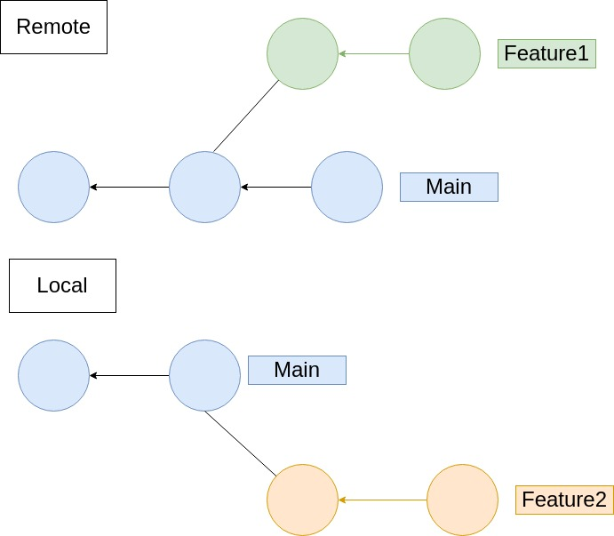

##  Working with a remote repository
(This document optimized for [reveal-md](https://github.com/webpro/reveal-md))

---

### Agenda
1. Intro to Remotes
1. Github 
1. Pull Request
1. Review our actions
1. Terminology recap

---

### Intro to Remotes
What is a remote repository?

* A version of your project, hosted in a cloud
<!-- .element: class="fragment" -->

* Git can work locally, but in most cases - a remote repository is required
<!-- .element: class="fragment" -->

* Remote repository (or simply remote) is called `origin` by default
<!-- .element: class="fragment" -->

* Git designed for distributed (offline) work - you'll need to sync with the remote yourself
<!-- .element: class="fragment" -->

* Upstream and Downstream
<!-- .element: class="fragment" -->

---

### Intro to Remotes
What is a remote repository?

* `git clone` - create a local copy of a remote repo
<!-- .element: class="fragment" -->

* `git fetch` - get updates from a remote repo
<!-- .element: class="fragment" -->

* `git pull` - `fetch` followed by `merge` (or `rebase`)
<!-- .element: class="fragment" -->

* `git push` - upload local repository content to a remote repository
<!-- .element: class="fragment" -->


---

### Intro to Remotes

<div>
    
</div>

---

### Github

What is Github?
(vs gitlab vs bitbucket)

[Features Overview](https://github.com/hasadna/anyway-newsflash-infographics)

Tip: To show in web editor - replace `com` with `dev`
<!-- .element: class="fragment" -->

---

### Github


[Using a personal access token](https://docs.github.com/en/authentication/keeping-your-account-and-data-secure/creating-a-personal-access-token)

[storing credentials](https://docs.github.com/en/get-started/getting-started-with-git/caching-your-github-credentials-in-git)

```
// to simulate a fresh machine
docker run -it --name=demo ubuntu:latest /bin/bash
apt-get update
apt-get install git
clone a private repo (use token)
docker container rm demo
```
---

### Github
Live demo - upload exist repo

create a new repo on Github, then:
```
git branch -M main (master to main)
git remote add origin <PATH_TO_REMOTE>
git push -u origin main
```

* origin is the remote name (default)
* `-u` set `main` on origin to be upstream of local `main`

---

### Github
Practice - create and clone a repo
1. create a repository on your github account
2. `git clone my-repo`

---

### Pull Request

A github specific term (bitbucket use the same name, gitlab named it "merge request)
<!-- .element: class="fragment" -->

A pull request is our way to say to the remote:
"Here are my changes, please merge them into branch X"
<!-- .element: class="fragment" -->

---

### Pull Request

Practice - create a Pull Request
1. Create branch `feature1`
2. Commit some changes to branch `feature1`
3. `git push -u origin feature1` (or `HEAD`)
4. Go to github and open a PR
5. Merge the PR

---

### Review our actions

1. Setting access
2. Creating a repository
3. Clone
4. Create a feature branch and commits

How does the repos diagram looks like now?
<!-- .element: class="fragment" -->

---

### Review our actions

5. Push
6. Pull Request
7. Merge

How does the repos diagram looks like now?
<!-- .element: class="fragment" -->

---

### [Terminology recap](https://opensource.com/article/19/2/git-terminology)

* Commit
<!-- .element: class="fragment" -->
* Branch
<!-- .element: class="fragment" -->
* Tag
<!-- .element: class="fragment" -->
* Master
<!-- .element: class="fragment" -->
* HEAD
<!-- .element: class="fragment" -->
* Detached HEAD
<!-- .element: class="fragment" -->
* Merge
<!-- .element: class="fragment" -->

---

### [Terminology recap](https://opensource.com/article/19/2/git-terminology)

<!-- .element: class="fragment" -->
* Workspace
<!-- .element: class="fragment" -->
* Staging / Index
<!-- .element: class="fragment" -->
* Stash
<!-- .element: class="fragment" -->
* Remote repository
<!-- .element: class="fragment" -->
* Upstream and Downstream
<!-- .element: class="fragment" -->
* Pull request
<!-- .element: class="fragment" -->
* Remote repository
<!-- .element: class="fragment" -->

